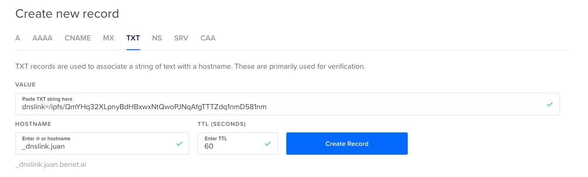

---
head:
  - - link
    - rel: canonical
      href: https://dnslink.dev/
---

## Introduction

DNSLink is a very simple protocol to link content and services directly from DNS.

DNSLink leverages the powerful distributed architecture of DNS for a variety of systems that require internet scale mutable names or pointers.


## How does it work?

With DNSLink, you can store a link using any DNS domain name. First, put the link in a `TXT` record at a specific subdomain. Then, you can resolve the link from any program by looking up the TXT record value. Your programs and systems can parse out the record value, and follow the link wherever it may go. Yes, it is that simple.

### DNSLink Format

DNSLink values are of the form:

```
dnslink=<value>
```

- The `<value>` is the link you want to set. The `<value>` is any link you wish to use. It could be a URL or a path. The `<value>` is in text form, not binary packed, so that it works well with DNS tooling and services.
  - _(Note: in the future, the value may be a [multiaddr](https://multiformats.io/multiaddr/), in text format. multiaddr is a format for specifying links and network addresses in a self-describing way.)_
- The prefix `dnslink=` is there to signal that this `TXT` record value is a DNSLink. This is important because many systems use TXT records, and there is a convention of storing multiple space separated values in a single `TXT` record. Following this format allows your DNSLink resolver to parse through whatever is in the `TXT` record and use the first entry prefixed with `dnslink=`.

### DNSLink chaining

As `RFC 1034` says:

> Of course, by the robustness principle, domain software should not fail
> when presented with CNAME chains or loops; CNAME chains should be followed
> and CNAME loops signalled as an error.

Tools should support DNSLink chaining and detect loops as errors.

```
> dig +short TXT _dnslink.test3.dnslink.dev
dnslink=/dnslink/test4.dnslink.dev
```

Should go on to resolve

```
> dig +short TXT _dnslink.test4.dnslink.dev
dnslink=/ipfs/Qmc2o4ZNtbinEmRF9UGouBYTuiHbtCSShMFRbBY5ZiZDmU
```

## Tutorial

### Step 0: Find something to link to.

In this tutorial, we'll link to [the libp2p website](https://libp2p.io), on [IPFS](https://ipfs.io). At the time of writing this, the website had the IPFS address:

```
/ipfs/Qmc2o4ZNtbinEmRF9UGouBYTuiHbtCSShMFRbBY5ZiZDmU
```

You can view this on the global IPFS gateway: https://ipfs.io/ipfs/Qmc2o4ZNtbinEmRF9UGouBYTuiHbtCSShMFRbBY5ZiZDmU

And even download it with ipfs:

```
ipfs get /ipfs/Qmc2o4ZNtbinEmRF9UGouBYTuiHbtCSShMFRbBY5ZiZDmU
```

### Step 1: Choose a domain name to link from.

For this tutorial, I'll use the domain name `libp2p.io`. You can use whatever domain you control. I happen to be using an `ALIAS` record on this domain as well (to make the website load directly via the IPFS gateway), but that is not a problem: the convention to prefix the domain with `_dnslink.` allows for complex DNS setups like this.

So the full domain name I'll set the record on is: `_dnslink.libp2p.io`.

### Step 2: Set the DNSLink value on a `TXT` record.

Let's set the link by creating a `TXT` record on the domain name. This is going to be specific to your DNS tooling. Unfortunately there is no standard cli tool or web service to set domain names :(. Every registrar and name server has its own web app, and API tooling. (yes, this is widely regarded as a poor state of affairs).

Consider setting the record, via an imaginary dns cli tool:
```
> my-dns-tool set --type=TXT --ttl=60 --domain=libp2p.io --name=_dnslink --value="dnslink=/ipfs/Qmc2o4ZNtbinEmRF9UGouBYTuiHbtCSShMFRbBY5ZiZDmU"
_dnslink.libp2p.io TXT 60 dnslink=/ipfs/Qmc2o4ZNtbinEmRF9UGouBYTuiHbtCSShMFRbBY5ZiZDmU
```

Or directly in a Digital Ocean prompt:




### Step 3: Resolve the link

Now, let's try resolving the link!

You can get the link value manually using `dig` or another dns lookup tool:

```
> dig +short TXT _dnslink.libp2p.io
dnslink=/ipfs/Qmc2o4ZNtbinEmRF9UGouBYTuiHbtCSShMFRbBY5ZiZDmU
```

Extract the value with `sed`:
```
> dig +short TXT _dnslink.libp2p.io | sed -E 's/"dnslink=(.*)"/\1/g'
/ipfs/Qmc2o4ZNtbinEmRF9UGouBYTuiHbtCSShMFRbBY5ZiZDmU
```

Then, you can feed the output of that to ipfs:

```
> ipfs ls /ipfs/Qmc2o4ZNtbinEmRF9UGouBYTuiHbtCSShMFRbBY5ZiZDmU
QmeotoX2bE7fVgMvUS9ZXL2RMoZQHiuQVZZR1Hts3JVmUT 265   _previous-versions
QmP5JpytsFEQ5Y8oQ875kPrdA1dAtyXAH6U8eKbTUbptNd -     bundles/
QmcRUrMyFePBNnvoqZB5Uk7y6aoWGoUW6EB8JWUxztKTma -     categories/
QmeVM9YZStiFcjjQYpzJ1KWJsaFGcRWaeMAymSfLydu9mh -     css/
QmRJjyE1Bi64AD7MSpt4xKHaiWXq7WGAne8KTzn7UyYeWq -     fonts/
Qma6Eg1JMAPjBg827ywDG1nx4TBwxYWxQxeb1CXUkDnrHk -     img/
QmdB9xXJHNXnaiikCXVpomHriNGXwvSUqdkC1krtFq4WWW -     implementations/
QmXCq4KMZC4mdxovpnrHU9K92LVBLSExLEsrvwTGNEswnv 62880 index.html
QmQNjTorGWRTqEwctqmdBfuBBRTj8vQD3iGjNNCu7vA5i9 3138  index.xml
QmPsosZeKZTUcBkcucPtPnk3fF4ia4vBdJ6str9CRr6VTQ -     js/
QmYBUY8Y8uXEAPJSvMTdpfGoL8bujNo4RKoxkCnnKXoTD9 -     media/
QmUZ23DEtL3aUFaLgCEQv5yEDigGP2ajioXPVZZ6S7DYVa 561   sitemap.xml
QmRgig5gnP8XJ16PWJW8qdjvayY7kQHaJTPfYWPSe2BAyN -     tags/
```

Or chain it all together:

```
> dig +short TXT _dnslink.libp2p.io | sed -E 's/"dnslink=(.*)"/\1/g' | ipfs ls
QmeotoX2bE7fVgMvUS9ZXL2RMoZQHiuQVZZR1Hts3JVmUT 265   _previous-versions
QmP5JpytsFEQ5Y8oQ875kPrdA1dAtyXAH6U8eKbTUbptNd -     bundles/
QmcRUrMyFePBNnvoqZB5Uk7y6aoWGoUW6EB8JWUxztKTma -     categories/
QmeVM9YZStiFcjjQYpzJ1KWJsaFGcRWaeMAymSfLydu9mh -     css/
QmRJjyE1Bi64AD7MSpt4xKHaiWXq7WGAne8KTzn7UyYeWq -     fonts/
Qma6Eg1JMAPjBg827ywDG1nx4TBwxYWxQxeb1CXUkDnrHk -     img/
QmdB9xXJHNXnaiikCXVpomHriNGXwvSUqdkC1krtFq4WWW -     implementations/
QmXCq4KMZC4mdxovpnrHU9K92LVBLSExLEsrvwTGNEswnv 62880 index.html
QmQNjTorGWRTqEwctqmdBfuBBRTj8vQD3iGjNNCu7vA5i9 3138  index.xml
QmPsosZeKZTUcBkcucPtPnk3fF4ia4vBdJ6str9CRr6VTQ -     js/
QmYBUY8Y8uXEAPJSvMTdpfGoL8bujNo4RKoxkCnnKXoTD9 -     media/
QmUZ23DEtL3aUFaLgCEQv5yEDigGP2ajioXPVZZ6S7DYVa 561   sitemap.xml
QmRgig5gnP8XJ16PWJW8qdjvayY7kQHaJTPfYWPSe2BAyN -     tags/
```

## Usage Examples

### Example: User-friendly name resolution within IPFS

IPFS has DNSLink resolution built in though, so you could just do the following to achieve the same result as in the tutorial above.

Given this dnslink:
```
> dig +short TXT _dnslink.libp2p.io
dnslink=/ipfs/Qmc2o4ZNtbinEmRF9UGouBYTuiHbtCSShMFRbBY5ZiZDmU
```

ipfs uses DNSLink to resolve it natively:
```
> ipfs ls /ipns/libp2p.io
QmeotoX2bE7fVgMvUS9ZXL2RMoZQHiuQVZZR1Hts3JVmUT 265   _previous-versions
QmP5JpytsFEQ5Y8oQ875kPrdA1dAtyXAH6U8eKbTUbptNd -     bundles/
QmcRUrMyFePBNnvoqZB5Uk7y6aoWGoUW6EB8JWUxztKTma -     categories/
QmeVM9YZStiFcjjQYpzJ1KWJsaFGcRWaeMAymSfLydu9mh -     css/
QmRJjyE1Bi64AD7MSpt4xKHaiWXq7WGAne8KTzn7UyYeWq -     fonts/
Qma6Eg1JMAPjBg827ywDG1nx4TBwxYWxQxeb1CXUkDnrHk -     img/
QmdB9xXJHNXnaiikCXVpomHriNGXwvSUqdkC1krtFq4WWW -     implementations/
QmXCq4KMZC4mdxovpnrHU9K92LVBLSExLEsrvwTGNEswnv 62880 index.html
QmQNjTorGWRTqEwctqmdBfuBBRTj8vQD3iGjNNCu7vA5i9 3138  index.xml
QmPsosZeKZTUcBkcucPtPnk3fF4ia4vBdJ6str9CRr6VTQ -     js/
QmYBUY8Y8uXEAPJSvMTdpfGoL8bujNo4RKoxkCnnKXoTD9 -     media/
QmUZ23DEtL3aUFaLgCEQv5yEDigGP2ajioXPVZZ6S7DYVa 561   sitemap.xml
QmRgig5gnP8XJ16PWJW8qdjvayY7kQHaJTPfYWPSe2BAyN -     tags/
```

You can find out more at the [IPFS DNSLink documentation](https://docs.ipfs.io/concepts/dnslink/).

### Example: IPFS Gateway

You can also just check it out on the web. The IPFS gateway resolves DNSLink automatically too. Check it out at https://ipfs.io/ipns/libp2p.io or https://dweb.link/ipns/libp2p.io which will provide proper origin isolation for use in browsers.

**How does that work?** The gateway takes the part after `/ipns/`, if it is a DNS domain name, it checks for a DNSLink at either the domain name, or `_dnslink.` prefixed version. In this case it finds our DNSLink at `_dnslink.libp2p.io` and resolves that.

**But what about [https://libp2p.io](https://libp2p.io)?** Yes, https://libp2p.io also works, that uses a combination of DNSLink, a `ALIAS` record in `libp2p.io`, and the ipfs gateway. Basically:
1. the browser first checks for `A` records for `libp2p.io`. dns finds an `ALIAS` to `gateway-int.ipfs.io`, and those `A` records:
    ```
    > dig A libp2p.io
    gateway.ipfs.io.        119     IN      A       209.94.90.1
    ```
2. the browser then connects to `http://209.94.90.1`, using a `HOST: libp2p.io` HTTP header.
3. the ipfs gateway reads the `HOST: libp2p.io` header, and -- recognizing a DNS name -- checks for an associated DNSLink at either `libp2p.io` or `_dnslink.libp2p.io`.
    ```
    > dig +short TXT _dnslink.libp2p.io
    "dnslink=/ipfs/Qmc2o4ZNtbinEmRF9UGouBYTuiHbtCSShMFRbBY5ZiZDmU"
    ```
4. The gateway finds the link at `_dnslink.libp2p.io` leading to `/ipfs/Qmc2o4ZNtbinEmRF9UGouBYTuiHbtCSShMFRbBY5ZiZDmU`.
5. The gateway fetches the IPFS web content at `/ipfs/Qmc2o4ZNtbinEmRF9UGouBYTuiHbtCSShMFRbBY5ZiZDmU` and serves it to the browser.
6. The browser renders it happily, preserving the original pretty name of `https://libp2p.io`


### Example: IPFS Companion

Similar to the IPFS Gateway, [IPFS Companion](https://github.com/ipfs-shipyard/ipfs-companion) uses DNSLink natively within the browser to resolve IPFS web content. IPFS Companion has a feature that tests domain names for the presence of dnslink `TXT` records, and if it finds them, then it serves content via IPFS instead.

You can find out more about how it works at [IPFS Companion's DNSLink documentation](https://github.com/ipfs-shipyard/ipfs-companion/blob/master/docs/dnslink.md).

## Tools

There are a number of tools related to DNSLink.

#### go-ipfs

go-ipfs has built-in support for resolving DNSLinks:

```
$ ipfs name resolve -r /ipns/libp2p.io
/ipfs/Qmc2o4ZNtbinEmRF9UGouBYTuiHbtCSShMFRbBY5ZiZDmU
```

One can also run HTTP Gateway capable of hosting DNSLink websites. See [examples](https://github.com/ipfs/go-ipfs/blob/master/docs/config.md#gateway-recipes).

#### go-dnslink

https://github.com/ipfs/go-dnslink - dnslink resolution in go (used by [go-ipfs](https://github.com/ipfs/go-ipfs))

#### js-dnslink

https://www.npmjs.com/package/dnslink - dnslink resolution in javascript

#### dnslink-deploy

https://github.com/ipfs/dnslink-deploy - `dnslink-deploy` a tool for setting DNSLinks on Digital Ocean (and maybe more someday others):

#### ipfs-deploy

https://github.com/ipfs-shipyard/ipfs-deploy - upload static website to IPFS pinning services and optionally update DNS (Cloudflare, DNSSimple)

## Docs

- IPFS and DNSLink: https://docs.ipfs.io/concepts/dnslink/
- IPFS Companion and DNSLink: https://docs.ipfs.io/how-to/dnslink-companion/
- DNSLink in Cloudflare's Gateway: https://developers.cloudflare.com/distributed-web/ipfs-gateway/connecting-website/
- Explanation of how DNSLink and the IPFS Gateway works: https://www.youtube.com/watch?v=YxKZFeDvcBs

## Known Users

### Systems

#### IPFS

IPFS is a heavy user of DNSLink. It is used in the core API, as part of IPNS, the name system IPFS uses. It is also used in a variety of tools around IPFS.

Learn more at the [IPFS and DNSLink documentation](https://docs.ipfs.io/concepts/dnslink/).

#### IPFS Gateway

The IPFS Gateway resolves DNSLinks automatically. See [gateway recipes](https://github.com/ipfs/go-ipfs/blob/master/docs/config.md#gateway-recipes).

#### IPFS Companion

[IPFS Companion](https://github.com/ipfs-shipyard/ipfs-companion) can resolve DNSLinks automatically. See more in the [IPFS Companion documentaion](https://docs.ipfs.io/how-to/dnslink-companion/).

#### add yours here

Add yours on github.

### Websites

Many websites use DNSLink and IPFS. Check some of them out:

- https://ipfs.io
- https://filecoin.io
- https://protocol.ai
- https://libp2p.io
- https://multiformats.io
- _add yours here_

## Best Practices

### Set a low `TTL` in the `TXT` record.

The default `TTL` for DNS records is usually `3600`, which is 1hr. We recommend setting a low `TTL` in the `TXT` record, something like `60` seconds or so. This makes it so you can update your name quickly, and use it for website deploys.

## FAQ

#### Is there an IETF RFC spec?

Not yet. We should write one.

#### Can I use DNSLink in non-DNS systems?

Yes absolutely. For example, you can use DNSLink to resolve names from Ethereum Name System (ENS) thanks to DNS-interop provided at https://eth.link. If you use DNSLink for something cool like this, be sure to add it to the [Users](#Users) section of this doc.

#### Why use `_dnslink.domain` instead of `domain`?

`_dnslink.domain` does not conflict with `CNAME` and `ALIAS` records, and is better for operations security: enables you to set up an automated publishing or delegate control over your DNSLink records to a third party without giving away full control over the original DNS zone.

`TXT` record on `domain` is deprecated and resolved by some software only for legacy reasons: we historically started with supporting records on the normal domain, and only found the issue with `CNAME` and `ALIAS` records later on. Those problems are absent when `_dnslink.domain` is used.

Rule of thumb: always use `_dnslink.domain`.

#### Why use the `dnslink=` prefix in the `TXT` value?

The prefix `dnslink=` is there to signal that this `TXT` record value is a DNSLink. This is important because many systems use TXT records, and there is a convention of storing multiple space separated values in a single `TXT` record. Following this format allows your DNSLink resolver to parse through whatever is in the `TXT` record and use the first entry prefixed with `dnslink=`.

#### Why not use other DNS record types, like `SRV`?

Special purpose records enforce some structure to their values, and these are not flexible enough. We wanted a simple protocol that allowed us to link to any other system or service, in perpetuity. This can only be achieved with systems designed to allow structure within the input. The `TXT` record is a good example of this -- it imposes a string value, but it allows the user to make sense out of anything within that string. Sets of users can imposese different rules for resolution. In our case, this is handled through [Multiaddr](https://multiformats.io/multiaddr).

#### Why not just extend DNS with more record types?

It seems that what DNSLink does could be accomplished by a verity of new special purpose record types. But extending DNS is a very expensive process -- in terms of time and adoption. We wanted to find a way to use all the existing infrastructure without requiring any changes at all.


#### Why DNS?

> The [Domain Name System](https://en.wikipedia.org/wiki/Domain_Name_System) (DNS) is a hierarchical and decentralized naming system for computers, services, or other resources connected to the Internet or a private network. ... By providing a worldwide, distributed directory service, the Domain Name System has been an essential component of the functionality of the Internet since 1985.

DNS is:
- **somewhat decentralized** - it delegates naming authority to nations and organizations world-wide
- **hierarchical** - it achieves scalable naming via name space partitioning
- **scalable** - it is the dominant name system on the planet -- most internet traffic uses it
- **ubiquitous** - as the dominant internet name system since 1985, DNS is well-known and well-supported.

As a name system, DNS has pragmatic solutions for:
- **control of names**
- **scalable naming**
- **scalable reads and writes**
- **partition tolerance**
- **and more**

Of course, DNS has shortcomings:
- **somewhat centralized** - central authorities manage DNS roots (ICANN, etc.)
- **censorable** - DNS is easy to censor, at the registrar and ISP levels
- **temporary** - DNS names are _rented_, not really _owned_, and can be revoked and seized
- **not offline-first** - DNS does not have good solutions for values to spread through intermittently connected networks
- **cumbersome** - buying, registering, and setting values on a name is more complicated than acquiring a mutable pointer should be.
- **not program friendly** - registering DNS names requires being a human or a human organization with human agents, with access to credit cards. this isn't suitable for lots of programs.

These are all good reasons to develop new, better name systems. But until those work better than DNS, you'll probably use DNS.

## Contributors

- [@jbenet](https://github.com/jbenet)
- [@whyrusleeping](https://github.com/whyrusleeping)
- [@lgierth](https://github.com/lgierth)
- [@victorbjelkholm](https://github.com/victorbjelkholm)
- [@diasdavid](https://github.com/diasdavid)
- [@martinheidegger](https://github.com/martinheidegger)
- and undoubtedly many more

Developed with the support of [Protocol Labs](https://protocol.ai)
